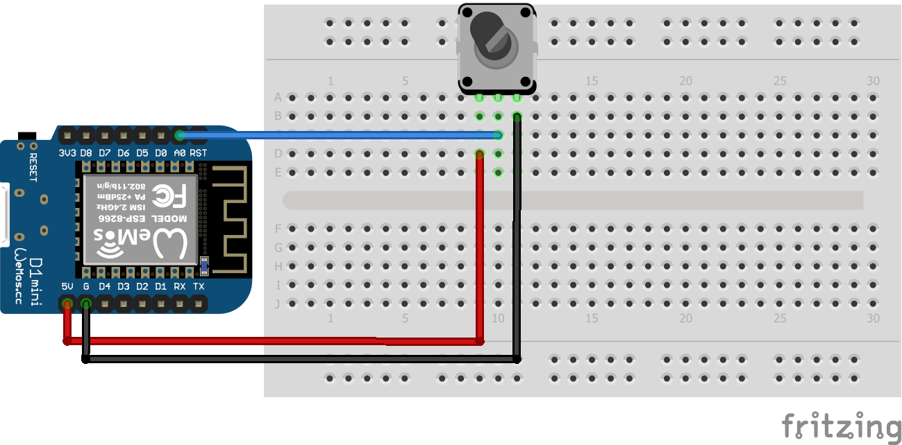

# Code&Share Connected Arduino Workshop

This repository contains example code for connecting wifi-enabled arduino boards and p5js sketches to the mqtt broker shiftr.io

## Hit the ground running
There's a few steps we have to do before we can program our arduinos:
1. Install Arduino IDE
2. Download the board information to the IDE
3. Install the mqtt library

### Install Arduino IDE
Download and install the arduino IDE from [https://www.arduino.cc/en/Main/Software](https://www.arduino.cc/en/Main/Software)

### Download board information
Open the preferences by clicking ```File``` -> ```Preferences```. Insert the following url ```http://arduino.esp8266.com/stable/package_esp8266com_index.json``` in the field names ```Additional Boards Manager URLs``` and press ```OK```.    

Then open ```Tools```-> ```Board:...```->```Boards Manager```. Search for "esp" and install the package named "esp8266 by ESP8266 Community".

### Install wifi and mqtt libraries
Go to ```Sketch``` -> ```Include Library```-> ```Manage Libraries`` and install the library named "MQTT by Joel Gaehwiler".

## Program the arduino
With the above done you will be able to upload working code to our arduinos.     
If you don't want to do any arduino programming you can use the code in the ```mqtt_arduino_sensor_code``` folder.     
If you want to write the code for reading your sensor you can use the code in the ```mqtt_arduino_scaffold```folder where only the code for wifi and mqtt communication is provided.

Whichever you choose you will need to supply a wifi credentials, credentials to the mqtt platform, and name your device with an ID.

The wifi credentials will be provided by Anders. The mqtt credentials is provided in this [google doc](https://docs.google.com/document/d/1YMwmPifAAta2u6-KhHG4d8jof3yF6wDDelFTvnyYoME/edit?usp=sharing). Please mark the credentials you use. The device ID can be whatever you want.  


## Arduino setups
All of the setups below can be used with the code in the ```mqtt_arduino_sensor_code``` fodlder. Remember to use the correct pins and read-functions depending on whether the sensor is analog or digital. It will be noted in the comments what you will need to change.

### Digital sensors
#### Button


#### Tilt


### Analog sensors
#### Force


#### Flex, slide & rotary slide
These 3 sensors are all set up in the same way as pictured with the flex sensor below. The leftmost leg of the component connected to 5v, the middle leg connected to A0 AND to a resitor that is then connected to ground.


#### Light


#### Potentiometer


## Get the data into p5js
For an example in how to connect a p5js sketch to the mqtt platform and receive your sensor-readings see the example provided by Tobas in the ```mqtt_p5js``` folder.
In the ```mqtt_p5js_scaffold``` folder there is barebones code that only handles the mqtt communication. The rest is up to you.
